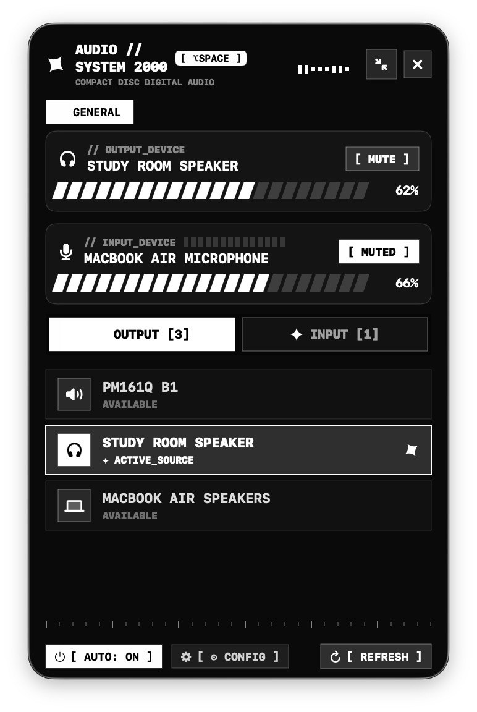

# AUDIO_CTRL // v2.0.0
> Y2K MONOCHROMATIC MACOS MENU BAR AUDIO CONTROLLER & SMART PRESET ROUTER

<div align="center">
  
</div>

---

## // DIRECT DOWNLOAD (NO XCODE REQUIRED)

Yes! General users **do not need Xcode** to run AUDIO CTRL. It runs as a native standalone macOS menu bar app.

- **[DOWNLOAD AUDIO_CTRL V2.0 (.ZIP)](https://github.com/reachforaryan/macos-audio_ctrl/tree/main/releases/latest/download)**

### Quick Install for End Users:
1. Download `UtilityToggle.zip` from the link above.
2. Unzip the file and drag **AUDIO CTRL.app** into your `/Applications` folder.
3. Open **AUDIO CTRL** from Finder or Spotlight (`Cmd + Space`).
4. (Optional) Click `[ CONFIG ]` and enable **Launch at Login** so AUDIO CTRL runs automatically whenever your Mac starts up!

---

## // OVERVIEW & USE CASES

AUDIO_CTRL is a lightweight macOS menu bar utility designed for fast, seamless audio device switching and volume control without opening System Settings.

- **Gaming & Streaming**: Instant one-click switch between desktop speakers and gaming headsets with custom volume levels.
- **Music & Audio Production**: Route input/output audio to external DACs and studio mics with real-time spectrum visualizers.
- **Work & Calls**: Quick mute toggles and mic peak monitoring directly from your menu bar or global hotkey.

---

## // FEATURES

- **AUDIO PROFILES**: Create custom profiles with assigned input/output hardware and volume presets.
- **ONLINE FALLBACK**: Automatic fallback to system default devices if target hardware is offline.
- **LIVE SOUND SPECTRUM**: Real-time 60 FPS output sound equalizer visualizer.
- **MENU BAR VOLUME %**: Live output volume percentage displayed next to status item (`🔊 85%`).
- **COLOR WHEEL THEME ENGINE**: Customize primary accent and secondary background colors via native macOS Color Wheels or Y2K presets.
- **GLOBAL SHORTCUT**: Press `Option + Space` anywhere to toggle the HUD popover.

---

## // DEVELOPER BUILD FROM SOURCE

### Prerequisites
- macOS 13.0 or later
- Xcode 14.0 or later

```bash
git clone https://github.com/reachforaryan/UtilityToggle.git
cd UtilityToggle
xcodebuild -project UtilityToggle.xcodeproj -scheme UtilityToggle -configuration Release build
```

---

## // LICENSE
MIT License. Built for macOS using Swift, SwiftUI, and CoreAudio HAL C-APIs.
